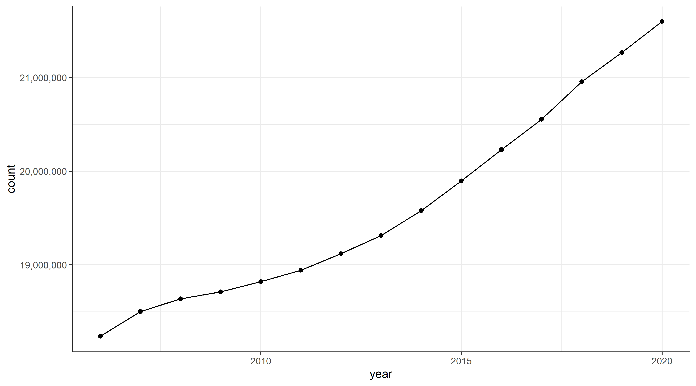
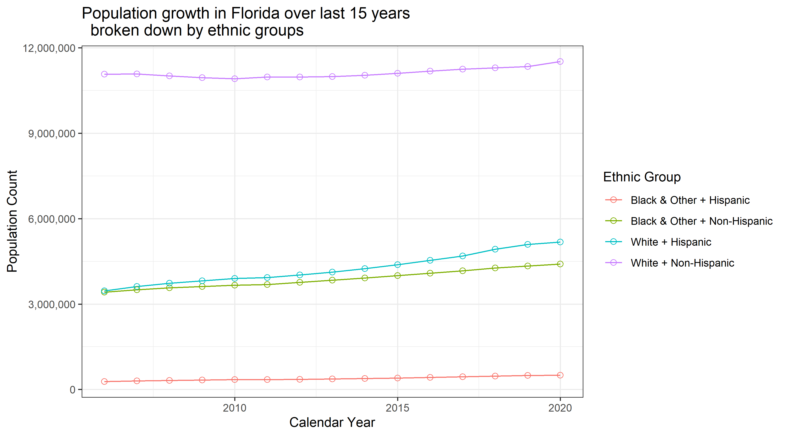
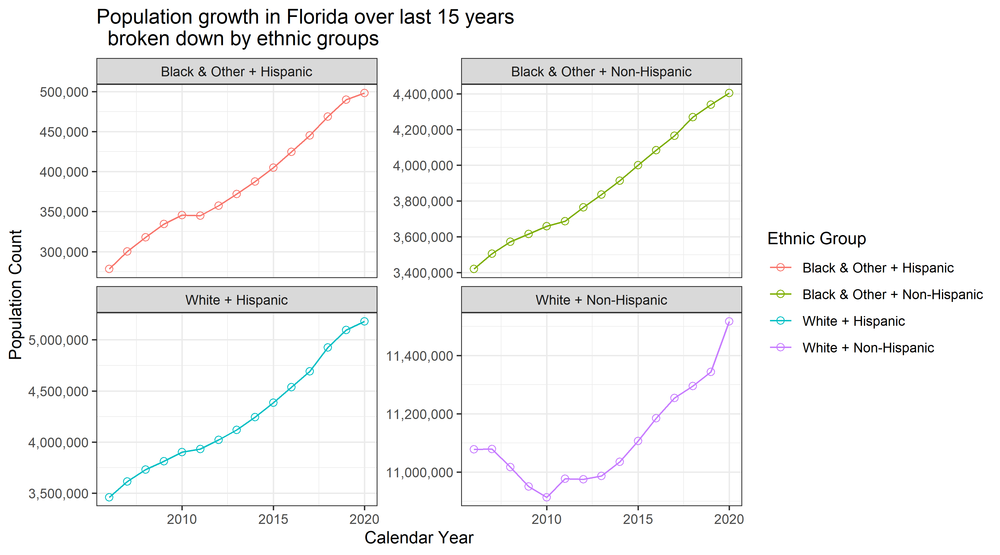
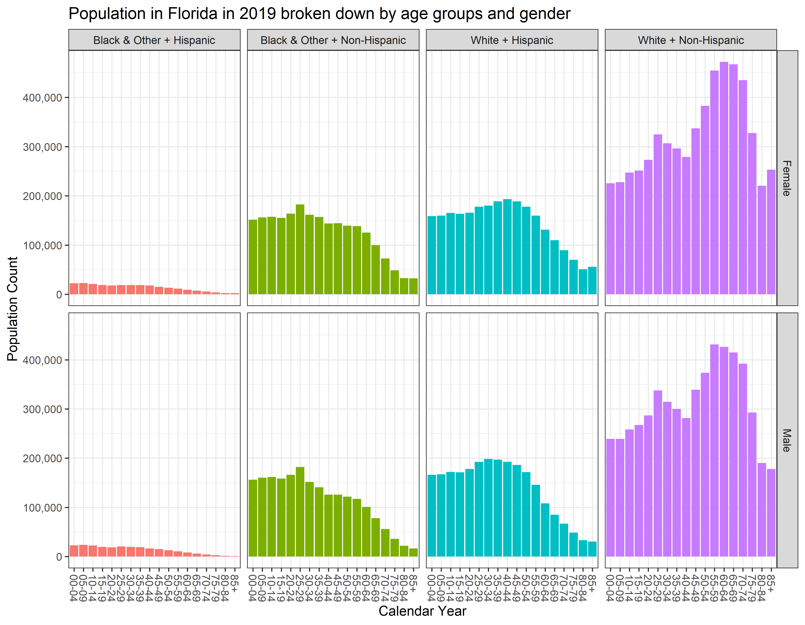
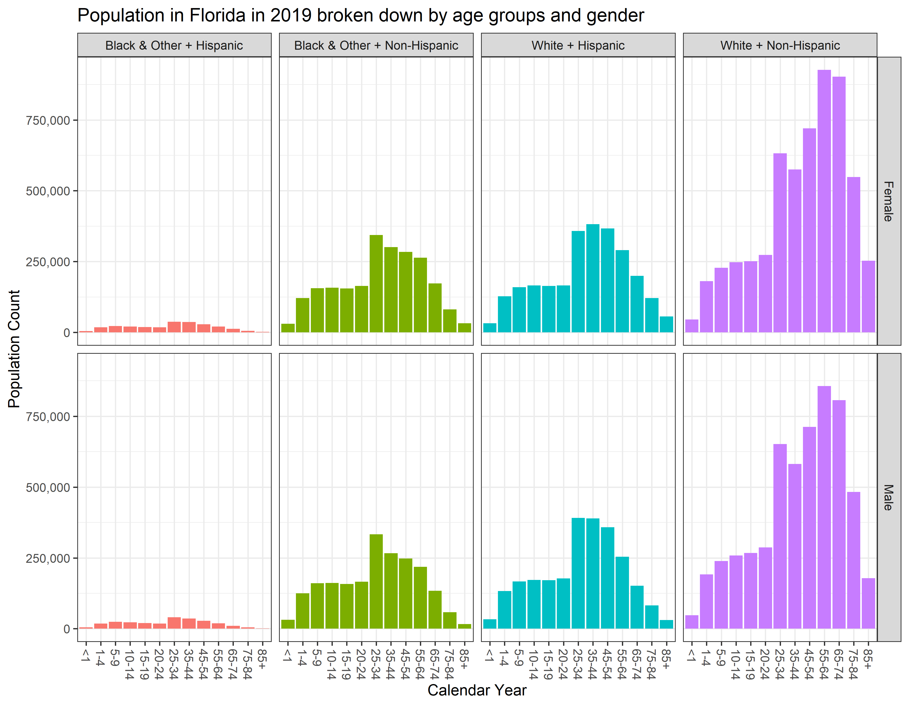

# Abstract

This blogposts shows how to extract population estimates data reported by the [Florida Department of Health](http://www.flhealthcharts.com/FLQUERY/Population/PopulationRpt.aspx) and prepare them for analysis, specifically, for exploring the trends in demographic growth between 2006 and 2020.

Click __[HERE](https://raw.githack.com/dss-hmi/suicide-prevention-2019/85e829e9a20aa3640051e8a019cdabeff5409701/analysis/blogposts/florida-demographic-growth/fl-demo-growth.html)__ to view report in its native environment of the [suicide-prevention-2019](https://github.com/dss-hmi/suicide-prevention-2019) repository.

# Data Origin

The initial extract of the data was obtained from [www.flhealthcharts.com](http://www.flhealthcharts.com/FLQUERY/Population/PopulationRpt.aspx), a reporting tool for population counts estimated by the Florida Department of Health. The figure below shows the modifications to the default query the produces the data product used in this demonstration:  

The tool gives the option to save the product of the query as an Excel book (`.xls`), however, the import of this extension into R has been problematic, so I have converted ("save as") the file manually into a more modern Excel format, `.xlsx`. This file is the raw source for the current report and can be dowloaded for closer inspection [here](https://github.com/dss-hmi/suicide-prevention-2019/raw/3ff78365931214e342640523f2096c2eac443b2f/analysis/blogposts/florida-demographic-growth/data/FloridaPopulation.xlsx). 

# Data import 

The structure of the Excel file requires some tidying to enable a nimble analytic flow

# Data Tweaking

We can identify several problems to address:  

1. Not all columns have names  
2. `race`, `ethnicity`, `sex`, and `age_group` are stored in merged spreadsheet cells     
3. Sums for categories are recorded in rows as observations (e.g `Total`)   
4. Some values of `age_group` are misinterpreted as dates (e.g. `1-4` becomes `4-Jan`)     
5. `age_group` does not bin the population evenly (e.g. `20-24` vs `25-34`)       

The cleaned version of this dataset is available for download [here](https://github.com/dss-hmi/suicide-prevention-2019/blob/4b2c812274c678b80ae351045619d3135d4e271f/analysis/blogposts/florida-demographic-growth/data/clean_data.rds).

# Graphing

We will consider several questions in order to demonstrate plotting from this cleaned dataset. 

1. How does the total population of Florida changes between 2006 and 2020?  
2. How does each ethnic group change during this time?  
3. what Ethnic group is most dissimilar from the other three in their dynamics?  
4. What would it look like if we used the original `age_group`?  

  

  

  

  

  