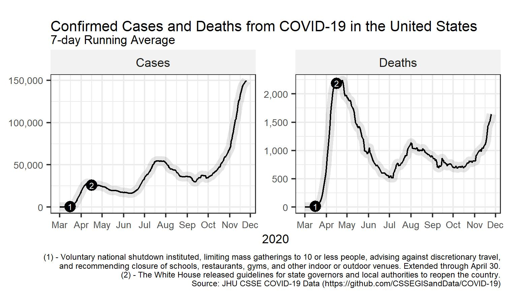

 

# Figures

# Reflections on US response

1. Initial containment measures (shutting borders, locking down) were delayed and were not mandated nationally.   
2. Testing got off to a slow start, never reached consistent sufficient capacity, and testing times remained too long, thereby impeding contact tracing.   
3. Initial physical and human resources were insufficient for a pandemic response and there were challenges building them up  
4. National leadership abdicated, and leadership fell to the states.  
5. Some states may have reopened too early and quickly.  
6. Noncompliance with mandates/guidelines may also have contributed to all three surges.  
7. Lack of entitlements to care may have affected access to testing, treatment and outcomes.  
8. The Trump Administration marginalised public health and scientific leaders, and contradicted and interfered with scientific guidelines and advice.  
9. The healthcare workforce was not protected   
10. Containment measures were politicised, and behaviour had a partisan basis.  

