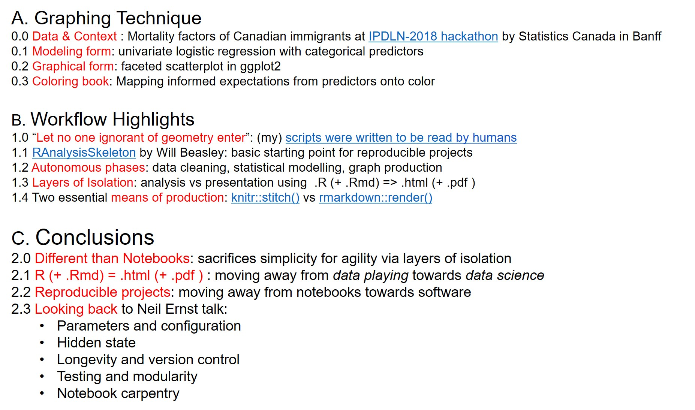
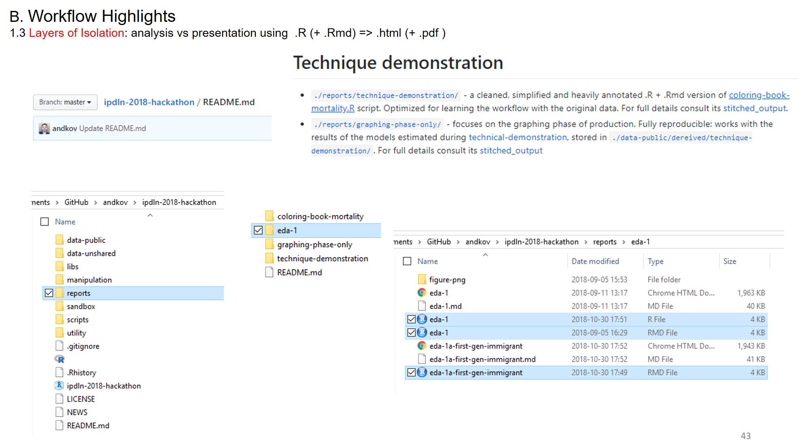

# Abstract

While computational notebooks offer scientists and engineers many helpful features, the limitations of this medium make it but a starting point in creating software - the practical goal of data science. Where do we go from computational notebooks if our projects require multiple interconnected scripts and dynamic documents? How do we ensure reproducibility amidst growing complexity of analyses and operations? 

I will use a concrete analytical example to demonstrate how constructing workflows for reproducible analyses can serve as the next step from computational notebooks towards creating an analytical software. First, I will demonstrate a reproducible graphing system designed for the IPDLN-2018 hackathon, organized by Statistics Canada. The system evaluates synthetic socioeconomic and mortality data with logistic regression. Then I will discuss the workflow of the project that implements this graphing system (github.com/andkov/ipdln-2018-hackathon ) and the RStudio + GitHub setup that hosts it. I will conclude by building the case to prefer reproducible workflows with version control over computational notebooks (e.g. Jupyter, R Notebook).

# Table of Content

# Layers of Isolation 

